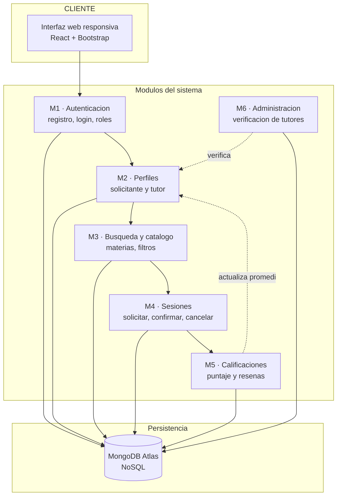
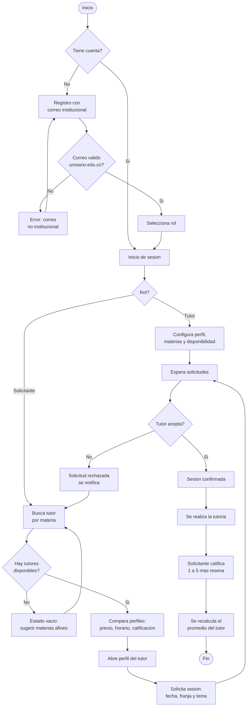
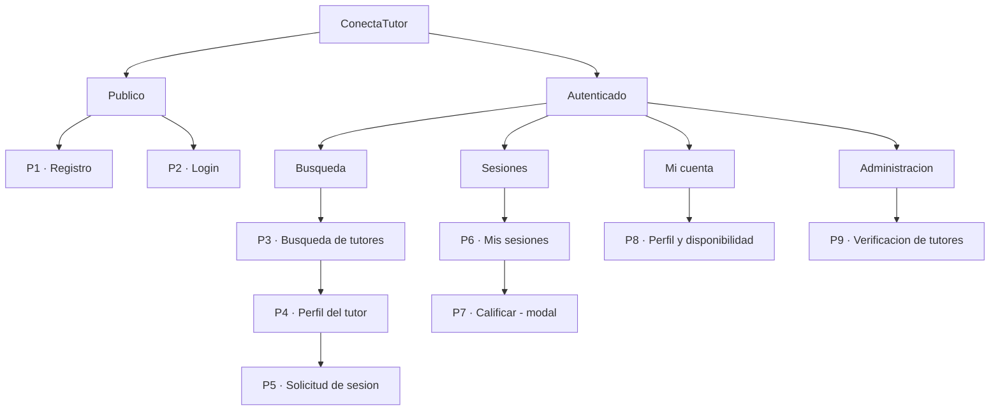
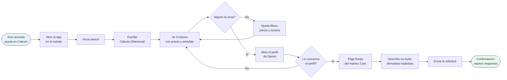
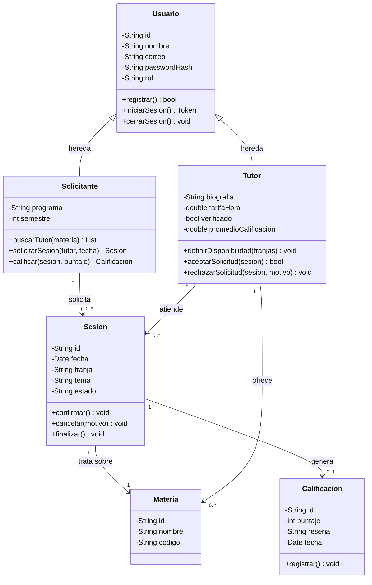
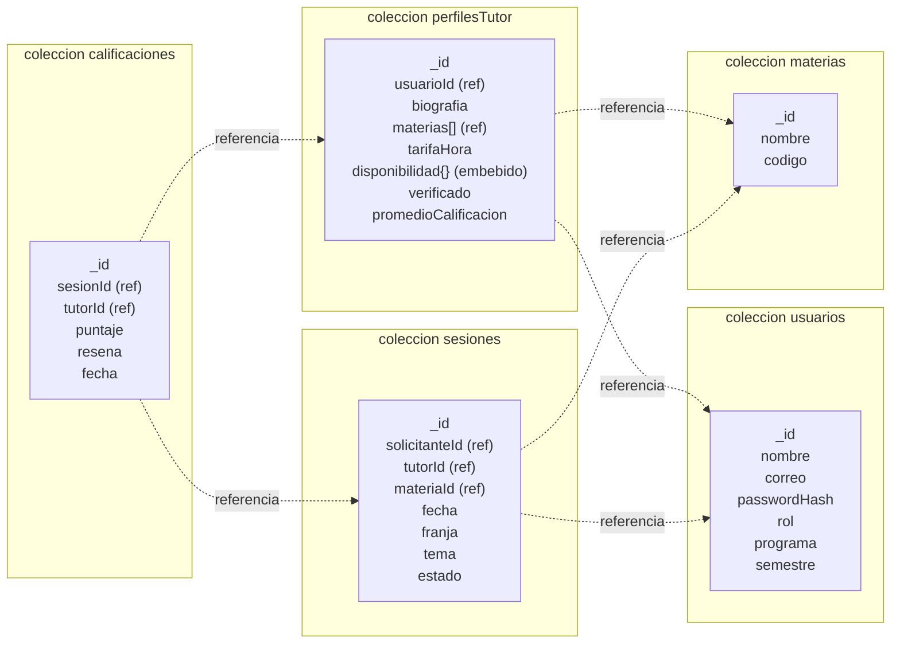

# LOS 6 DIAGRAMAS — listos en Mermaid

> **Cómo usarlos:** entra a **https://mermaid.live**, pega el bloque y exporta como PNG o SVG.
> Si prefieres draw.io: *Extras → Edit Diagram* también acepta Mermaid.
> Después ajusta colores y tipografía para que combinen con tu guía de estilo.

**Esto te ahorra la mayor parte de las 2h del martes en la tarde.** Revisa que cada uno refleje TU proyecto antes de pegarlo en el informe: en la sustentación te preguntan por lo que dibujaste.

---

## 1. Diagrama de solución *(Fase 2 — Planeación)*

Los módulos del sistema y cómo se relacionan.

---

## 2. Diagrama de flujo de la solución *(Fase 2 — Planeación)*

El proceso con decisiones. **Distinto del anterior:** aquí importan el orden y las bifurcaciones.

---

## 3. Mapa de navegación *(Fase 3 — Diseño)*

Estructura jerárquica del sitio: qué pantalla cuelga de cuál.

---

## 4. User flow *(Fase 3 — Diseño)*

⚠️ **No es lo mismo que el mapa de navegación.** Aquí es el camino para lograr **una tarea**: conseguir una tutoría.

---

## 5. Diagrama de clases *(módulo M4 — Sesiones)*

Recuerda: la profesora pidió **un módulo**, no todo el sistema.

---

## 6. Arquitectura de base de datos *(NoSQL — modelo de documentos)*

⚠️ **No es un entidad-relación.** Es MongoDB: colecciones de documentos con referencias y objetos embebidos.

**Convención:** `(ref)` referencia a otra colección · `(embebido)` objeto anidado dentro del documento · `[]` arreglo

### Justificación de NoSQL (va en el informe, sección 22)
- **Esquema flexible:** la disponibilidad del tutor es una estructura anidada por día y franja que no encaja bien en tablas.
- **Documentos embebidos:** la disponibilidad vive dentro del perfil y se lee en una sola consulta.
- **Lecturas dominantes:** la operación más frecuente es buscar tutores por materia, que se resuelve con un índice sobre `materias[]`.
- **Stack del curso:** MongoDB Atlas es la base definida en los lineamientos.

---

## Antes de pegarlos en el informe

- [ ] Verifica que los 6 módulos del diagrama de solución coincidan con las 9 pantallas de tu Figma
- [ ] Verifica que los estados de `Sesion` sean los mismos que usas en el prototipo (pendiente / confirmada / finalizada / cancelada)
- [ ] Exporta cada uno en PNG a buena resolución: en el proyector se ven borrosos si los sacas pequeños
- [ ] Ponle pie a cada figura (*"Figura N. Diagrama de..."*) y referéncialas en el texto
